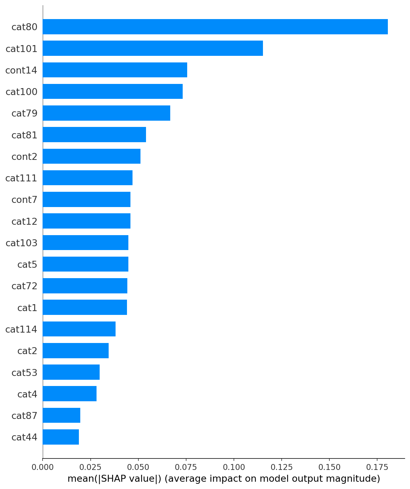
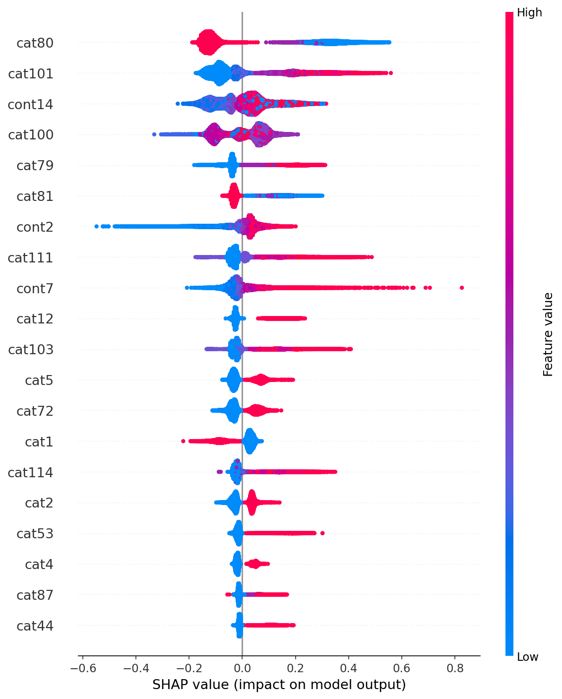
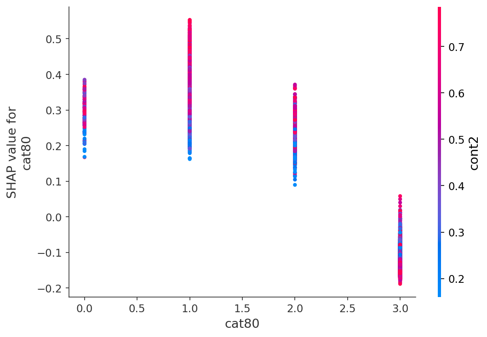
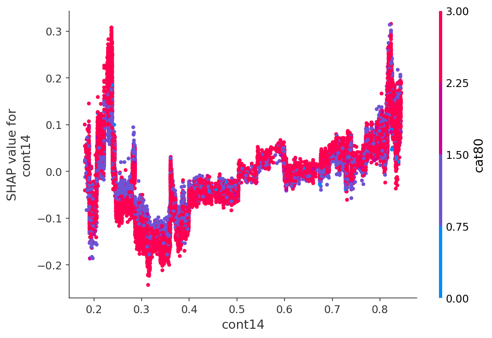
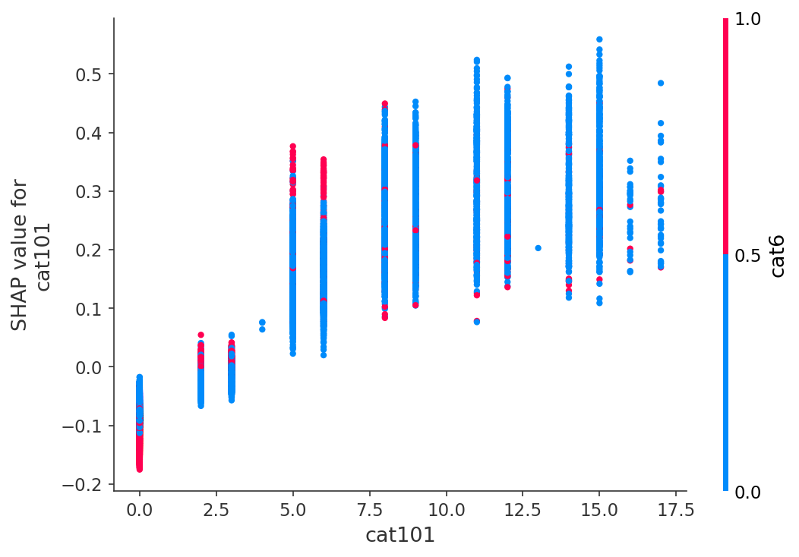
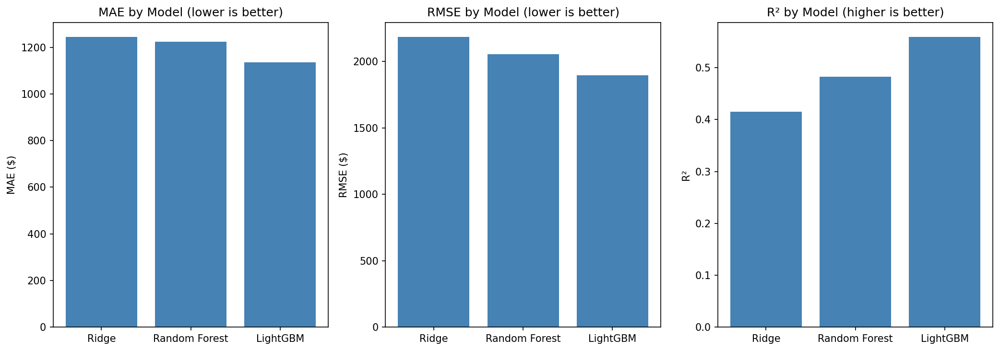
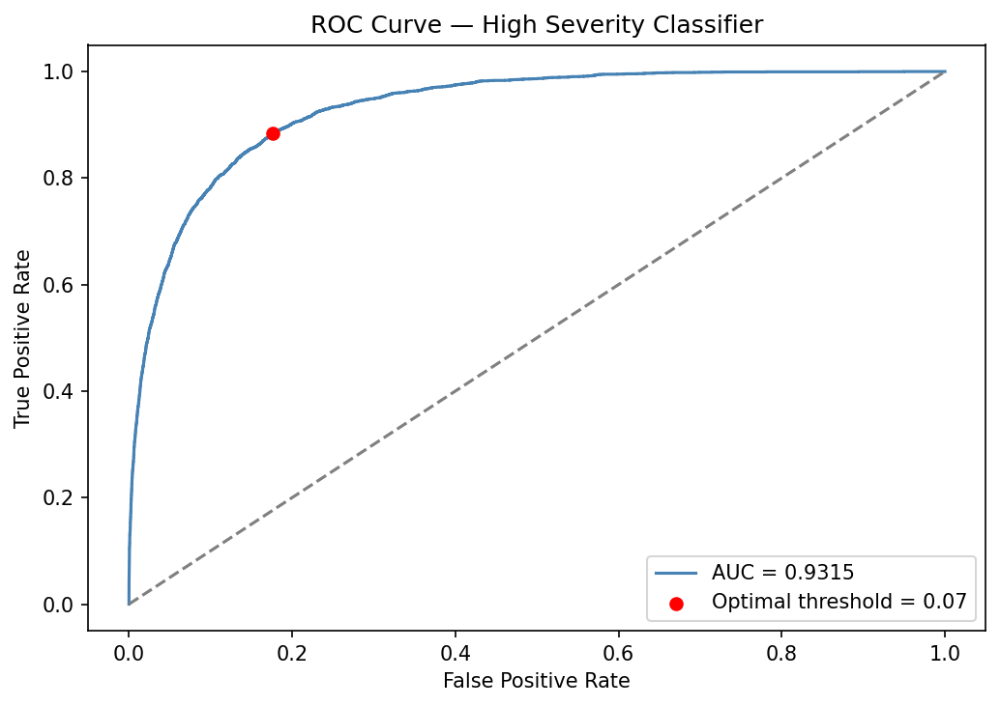
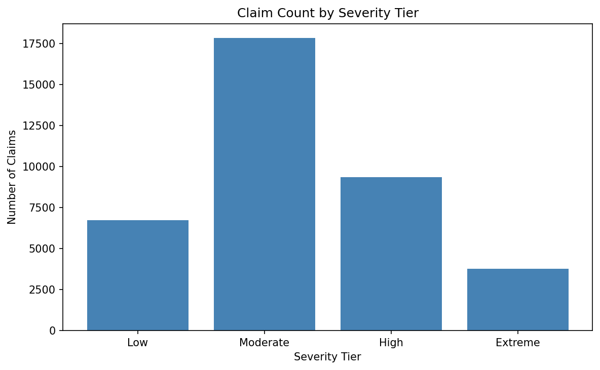
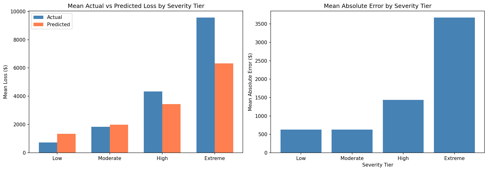
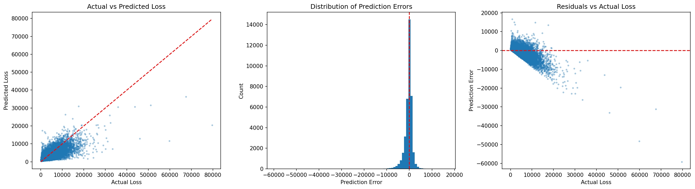

# Allstate Claims Severity — Insurance Loss Prediction API

**DATA 6545: Data Science and MLOps | Spring 2026 | Connor Hernon**

A production-grade machine learning system that predicts the financial severity of insurance claims using the [Allstate Claims Severity](https://www.kaggle.com/c/allstate-claims-severity) dataset. The system exposes a REST API for scoring new claims with a predicted dollar loss, severity tier classification, and a high-severity risk flag for triage prioritization.

---

## Final Project Requirements Checklist

This repository is structured to satisfy all DATA 6545 Final Project technical requirements.

| Requirement | Where Completed |
|---|---|
| New dataset/problem | Allstate Claims Severity Kaggle dataset |
| Supervised learning problem | Regression (loss prediction) + classification (high-severity flag) |
| 5,000+ rows | 188,318 training rows |
| 10+ features | 130 engineered features |
| Clear business problem | Insurance claim severity prediction for triage and reserving |
| Defined target variable | `loss` |
| Evaluation metrics | MAE, RMSE, R² (regression); AUC-ROC, precision, recall, F1 (classification) |
| Baseline model | Ridge Regression |
| Model comparison | Ridge, Random Forest, LightGBM |
| Trained model artifacts | `/models` directory |
| Technical artifact | Flask API, Docker deployment, Streamlit dashboard |
| Experiment tracking | `mlflow_run_summary.csv` |
| Reproducibility | `train_model.py`, `requirements.txt`, setup instructions |
| Ethical considerations | Documented in README |

The goal of this repository is to provide a fully reproducible machine learning pipeline and deployable prediction system.

---

## Live API

> **Base URL:** `https://allstate-severity-api.onrender.com`

| Method | Endpoint | Description |
|--------|----------|-------------|
| GET | `/health` | Liveness check — confirms the service is running |
| GET | `/model_info` | Model metadata, feature counts, tier boundaries, and validation metrics |
| POST | `/predict` | Score a single claim and return predicted loss + severity tier |
| POST | `/predict_batch` | Score up to 500 claims in one request |

### Example: Single Prediction

```bash
curl -X POST https://allstate-severity-api.onrender.com/predict \
  -H "Content-Type: application/json" \
  -d '{"cat1": "A", "cat80": "D", "cont1": 0.72, "cont14": 0.71}'
```

```json
{
  "predicted_loss": 2847.35,
  "severity_tier": "Moderate",
  "high_severity_flag": false,
  "high_severity_probability": 0.0821,
  "warnings": []
}
```

Partial payloads are supported — any features not provided default to safe values. The `warnings` field surfaces any input values that fall outside the expected range.

### Example: Batch Prediction

```bash
curl -X POST https://allstate-severity-api.onrender.com/predict_batch \
  -H "Content-Type: application/json" \
  -d '{
    "claims": [
      {"cat1": "A", "cat80": "D", "cont14": 0.71},
      {"cat1": "B", "cat80": "A", "cont14": 0.25}
    ]
  }'
```

```json
{
  "total_claims": 2,
  "predictions": [
    {"index": 0, "predicted_loss": 2847.35, "severity_tier": "Moderate", "high_severity_flag": false, "high_severity_probability": 0.0821, "warnings": []},
    {"index": 1, "predicted_loss": 7104.18, "severity_tier": "Extreme",  "high_severity_flag": true,  "high_severity_probability": 0.8143, "warnings": []}
  ]
}
```

---

## Project Structure

```
allstate-severity-api/
├── notebooks/
│   ├── Group_7_Connor_Hernon_Final_Project_Part_1_CV_Results.ipynb
│   └── Group_7_Connor_Hernon_Part_2_Final_Project.ipynb
├── models/
│   ├── lgbm_regressor.joblib
│   ├── lgbm_classifier.joblib
│   ├── label_encoders.joblib
│   └── metadata.joblib
├── figures/
│   ├── shap_summary_dot.png
│   ├── shap_summary_bar.png
│   ├── shap_dependence_cat80.png
│   ├── shap_dependence_cont14.png
│   ├── shap_dependence_cat101.png
│   ├── model_comparison.png
│   ├── roc_curve.png
│   ├── severity_tier_counts.png
│   ├── severity_tier_analysis.png
│   └── error_analysis.png
├── app.py
├── train_model.py
├── mlflow_run_summary.csv
├── requirements.txt
├── Dockerfile
└── render.yaml
```

> **Claims Dashboard:** A companion Streamlit app visualizing all 125,546 test predictions is maintained at [github.com/hernon33/allstate-claims-dashboard](https://github.com/hernon33/allstate-claims-dashboard).

---

## Model Performance

Trained on the Allstate Claims Severity dataset (188,318 training rows, 130 features).

### Regression — Predict Claim Loss in USD

| Model | MAE | RMSE | R² |
|-------|-----|------|----|
| Ridge Regression (baseline) | $1,244.68 | $2,185.06 | 0.4149 |
| Random Forest | $1,223.44 | $2,055.23 | 0.4823 |
| **LightGBM (final)** | **$1,135.16** | **$1,895.83** | **0.5595** |

5-fold cross-validation on LightGBM: **Mean MAE $1,145.91 ± $7.95** — stable across all folds with no evidence of overfitting.

### Classification — Flag High-Severity Claims

High-severity threshold: **$6,401.74** (90th percentile of training loss distribution)

| Metric | Value |
|--------|-------|
| AUC-ROC | 0.9315 |
| Precision (high severity) | 0.72 |
| Recall (high severity) | 0.47 |
| F1 (high severity) | 0.57 |

### Severity Tier Distribution (125,546 Test Claims)

| Tier | Loss Range | Claims | % of Total |
|------|------------|--------|------------|
| Low | < $1,000 | 9,784 | 7.8% |
| Moderate | $1,000–$3,000 | 80,756 | 64.3% |
| High | $3,000–$6,401 | 28,049 | 22.4% |
| Extreme | > $6,401 | 6,957 | 5.5% |

---

## Experiment Tracking

Model experiments were tracked using MLflow. A summary of all runs, including model types, hyperparameters, and evaluation metrics, is available in `mlflow_run_summary.csv`.

## Key Findings

- **cat80** is the single most predictive feature by a significant margin — SHAP analysis shows it cleanly partitions claims into one lower-risk group and three higher-risk groups
- **cont14** exhibits a highly nonlinear relationship with loss, with sharp jumps at approximately 0.25 and 0.82 — this pattern is invisible to linear regression but captured precisely by gradient boosting splits, which explains most of the performance gap between Ridge and LightGBM
- The model performs well on Low and Moderate claims but **systematically underpredicts Extreme claims** (mean error −$3,237 on claims above the high-severity threshold), a known limitation of point-estimate regression on heavy-tailed distributions
- Cross-validation standard deviation of $7.95 confirms the model is stable and the held-out validation result is not the product of a favorable split

---

## Visualizations

### SHAP Feature Importance



### Top Feature Dependence Plots




### Model Comparison


### Classifier Performance


### Severity Tier Analysis



### Error Analysis


---

## How to Reproduce

### 1. Clone the repository

```bash
git clone https://github.com/hernon33/allstate-severity-api.git
cd allstate-severity-api
```

### 2. Install dependencies

```bash
pip install -r requirements.txt
```

### 3. Download the data

Download `train.csv` and `test.csv` from [Kaggle](https://www.kaggle.com/c/allstate-claims-severity/data) and place them in `data/raw/`.

### 4. Train the models

```bash
python train_model.py --data_dir ./data/raw --output_dir ./models
```

This trains both models, runs 5-fold cross-validation, logs all runs to MLflow, and saves all four artifacts to `./models/`.

### 5. Run the API locally

```bash
python app.py
```

Or with Gunicorn:

```bash
gunicorn --bind 0.0.0.0:5000 app:app
```

### 6. Run with Docker

```bash
docker build -t allstate-api .
docker run -p 8080:8080 allstate-api
```

---

## Deploying to Render

The repository includes a `render.yaml` that configures the deployment automatically.

1. Push this repository to GitHub (the `models/` directory must be included)
2. Log into [render.com](https://render.com) → New Web Service → Connect repository
3. Render detects `render.yaml` and configures the build automatically
4. Render polls `/health` every 30 seconds — a 200 response confirms a successful deployment
5. Every push to `main` triggers an automatic redeploy

---

## Technical Architecture

The API loads all four model artifacts once at startup. Incoming requests are processed through a consistent encoding pipeline that mirrors training exactly — categorical features are encoded using the same fitted `LabelEncoder` objects from training (stored in `label_encoders.joblib`), and the feature matrix is aligned to the full 130-column training schema before inference regardless of how many fields the caller provides. Unknown categories fall back to index 0. Missing continuous features default to 0.0. Out-of-range continuous values are flagged in the `warnings` field without blocking the prediction.

---

## Limitations

- The dataset is fully anonymized — feature names like `cat80` and `cont14` carry no real-world label, which limits the business interpretability of SHAP explanations
- The model systematically underpredicts extreme claims, which are the most financially consequential segment for reserve planning
- Recall on high-severity claims is 0.47 at the default 0.5 threshold — lowering the threshold improves recall but increases false positives, a tradeoff that should be calibrated to operational capacity
- No time-based features are available, so claim development over time cannot be modeled
- Bias auditing is not possible without de-anonymization — categorical features may encode proxies for protected characteristics

---

## Ethical Considerations

- **Potential harms:** The system could be used to deprioritize claims based on predicted cost rather than actual need. The documented underprediction on extreme claims means the highest-need claimants may be systematically underserved by a triage system that relies on these predictions
- **Bias:** Anonymized features may encode geographic region, claim type, or other attributes that correlate with protected characteristics. A full disparate impact analysis would be required before any production deployment
- **Privacy:** The Kaggle dataset contains no PII. The deployed API does not log or store any submitted claim data
- **Misuse:** A model with AUC 0.93 is powerful enough to meaningfully alter claim handling workflows. It should be positioned as a prioritization support tool, not a decision-making system, with human oversight at the decision layer
- **Transparency:** SHAP values provide per-prediction feature attributions, but without feature de-anonymization these cannot be explained to affected claimants in meaningful terms

---

## Dependencies

- Python 3.11
- `lightgbm==4.3.0`
- `scikit-learn==1.4.2`
- `flask==3.0.3`
- `gunicorn==22.0.0`
- `numpy`, `pandas`, `joblib`, `shap`, `mlflow`

See `requirements.txt` for pinned versions.
